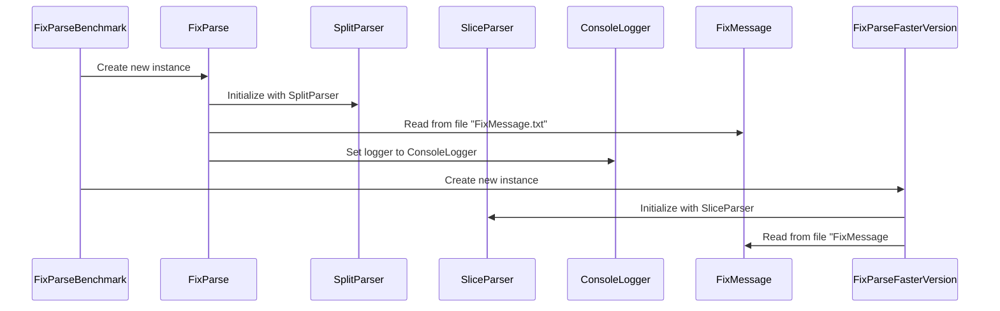

```mermaid
sequenceDiagram
    participant FixParseBenchmark as FixParseBenchmark
    participant FixParse as FixParse
    participant SplitParser as SplitParser
    participant SliceParser as SliceParser
    participant ConsoleLogger as ConsoleLogger

    FixParseBenchmark->>FixParse: Create new instance
    FixParse->>SplitParser: Initialize with SplitParser
    FixParse->>FixMessage: Read from file "FixMessage.txt"
    FixParse->>ConsoleLogger: Set logger to ConsoleLogger

    FixParseBenchmark->>FixParseFasterVersion: Create new instance
    FixParseFasterVersion->>SliceParser: Initialize with SliceParser
    FixParseFasterVersion->>FixMessage: Read from file "FixMessage
```
